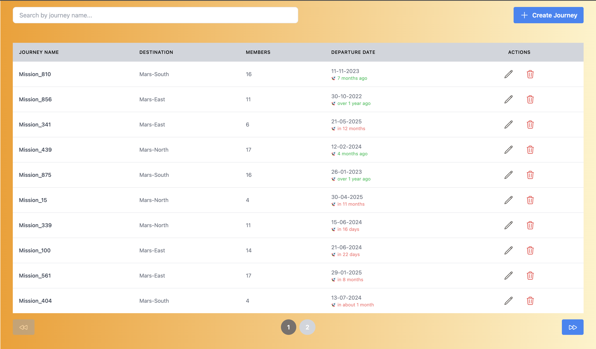
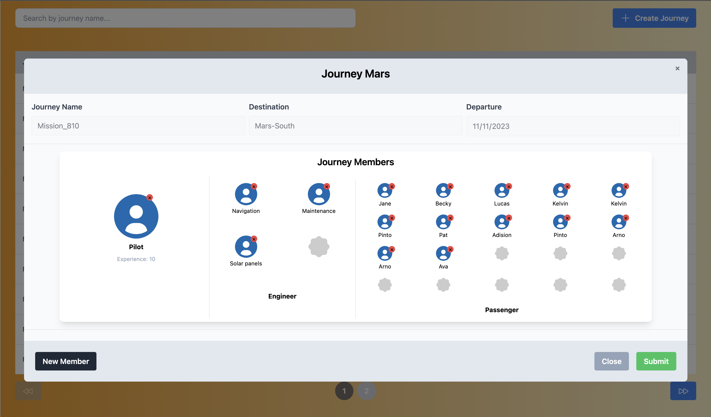
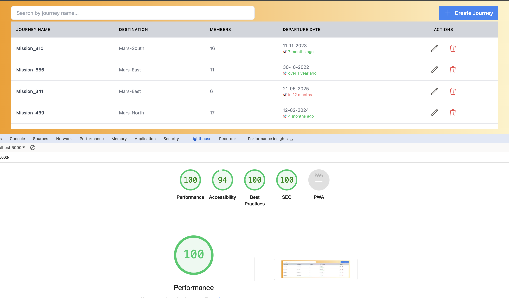

# Journey Mars

## Introduction

As humanity sets its sights on Mars, we are developing the "Journey Orchestrator" to manage the complexities of interplanetary travel. This platform aims to streamline the coordination of setting up a colony on Mars, ensuring mission planning and execution are meticulously organized. This application allows users to add, edit, and manage mission details and crew assignments.

## Features

-   List of journeys.
-   Add new journey.
-   Edit existing journey.
-   Manage member assignments for each journey.
-   Form validation.

#### Additional Features

-   Filtering/search functionality by journey name.
-   Responsive and accessible user interface.

## Tech Stack

**Client:** React, TypeScript, Redux, React Hooks, TailwindCSS

**Server:** Node

**Testing:** Jest, React Testing Library

**Code Quality & Formatting :** ESlint, Prettier

**Bundler:** Webpack, babel

**Pre-commit Hook:** Husky

**Deployment:** Docker

## Project Setup

### Prerequisites

-   Node.js
-   npm
-   Docker

### Installation

Clone the repository:

```
git clone https://github.com/rahul1915/journey-mars.git
```

Navigate to the project directory:

```
cd journey-mars
```

Install dependencies:

```
make install
```

### Running the Application:

#### Local Environment

```
make start
```

Open your browser and navigate to http://localhost:5000.

#### Remote Environment (mimic)

Create docker image

```
docker build -t <name> .
```

Run docker image

```
docker container run -p 3000:5000 <docker image>
```

Open your browser and navigate to http://localhost:3000.

#### Running Tests

```
npm run test
```

#### Other scripts 

Code Quality & Formatting

```
npm run lint
npm run lin:fix
npm run format
```
Pre Commit
```
npm run pc
```


## Project Structure

```bash
  /src
      /components
          /base
              Button.tsx
              Input.tsx
              Select.tsx
          /journey
              /filter
                  JourneyFilter.tsx
              /form
                    BaseDetails.tsx
                    Card.tsx
                    EngineerForm.tsx
                    PassengerForm.tsx
                    PilotForm.tsx
              /modal
                    JourneyModal.tsx
              /table
                    JourneyTable.tsx
                    JourneyTablePagination.tsx
                    JourneyTableRow.tsx
          /toast
              toast.tsx
      /hooks
          useFormValidation.ts
          useJourneyStore.ts
          useModal.ts
          usePagination.ts
          useToast.ts
      /pages
          JourneyView.tsx
      /store
          intex.ts
          journeySlice.ts
      /types
          types.ts
      /utils
        utils.ts
        validation.ts
      App.tsx
      index.tsx
      index.html
      index.css
```

## Detailed Description

**Components**

```
JourneyView.tsx: Component to display the list of journeys with options to initiate edit and delete journey.

JourneyModal.tsx: Modal component to wrap the form for better UI/UX. Allow user to perform create/edit journeys.

Card.tsx: Dispaly of Members for a Journey with remove option.

JournetFilter.tsx: Fliter option for Journey list.
```

```
Resuable Components

Button.tsx
Input.tsx
Select.tsx
JourneyTable.tsx
JourneyTableRow.tsx
JourneyTablePagination.tsx
```

## Screenshots





## Accessibility & Performance

#### Lighthouse report.



## Usage Guide

-   Add a Journey: Click the "Create Journey" button, fill out the form, and submit.
-   Edit a Journey: Click the edit button on each row of journey table, update the details in the form, and submit.
-   Delete a Journey: Click the delete button on each row of journey table.
-   Filter Journey: Use the search bar to filter journey by name.
